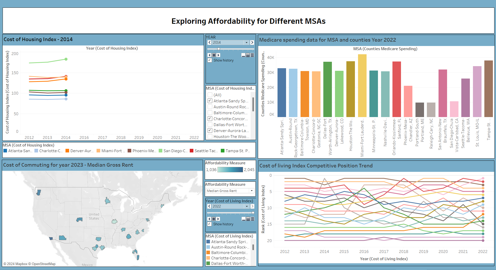
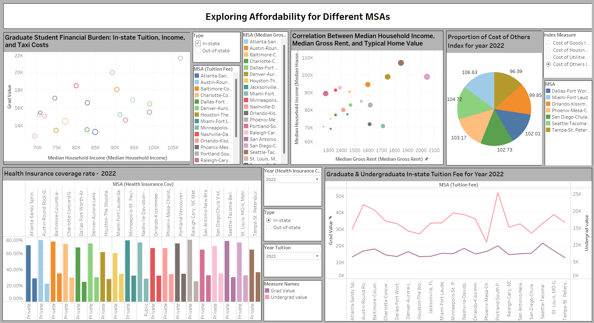

# Exploring Affordability for Different MSAs

## Overview

This repository contains the dataset and details pertaining to the comprehensive analysis of affordability across various Metropolitan Statistical Areas (MSAs) in the United States. The project examines housing affordability, education costs, healthcare access, commuting expenses, and the overall cost of living, providing valuable insights into the affordability landscape of different MSAs.

## Dashboard

You can find the interactive dashboards here:

[Affordability Dashboard 1](https://public.tableau.com/views/ExploringAffordabilityfordifferentMSAs1/Dashboard1?:language=en-US&:sid=&:display_count=n&:origin=viz_share_link)

[Affordability Dashboard 2](https://public.tableau.com/views/ExploringAffordabilityfordifferentMSAs2/Dashboard2?:language=en-US&:sid=&:display_count=n&:origin=viz_share_link)

## Dataset

The datasets used in this project are sourced from various reputable institutions to ensure accurate and comprehensive analysis. The key datasets include:

- **Bureau of Economic Analysis (BEA)**: Cost indexes for goods, utilities, housing, and overall living.
- **Integrated Postsecondary Education System (IPEDS)**: Graduate and undergraduate tuition fees.
- **US Census Bureau**: Median gross rent, median household income, and health insurance coverage rates.
- **Centers for Medicare and Medicaid Services**: Medicare spending data.
- **Numbeo Data 2023**: Commuting costs including taxi fares and gasoline prices.
- **Zillow Research**: Typical home value data.

You can find the dataset in this repository or view it [here](./Data.xlsx).

## Visual Data Insights:

- **Cost of Housing Index (2012-2022)**: A trend analysis showing the variation in housing costs across different MSAs.
- **Medicare Spending Data (2022)**: Breakdown of Medicare spending by MSAs and counties.
- **Cost of Living Index Trend (2012-2022)**: Animated line graph depicting the ranking changes in cost of living across MSAs.
- **Proportion of Cost Indexes (2022)**: Pie chart illustrating the contribution of various cost indexes to the overall cost of living.
- **Income and Housing Correlation (2018-2022)**: Scatter plot showing the relationship between median household income, gross rent, and home value.
- **Graduate and Undergraduate Tuition Fees (2011-2022)**: Line graph with dual axes for in-state and out-of-state tuition fees.
- **Cost of Commuting (2023)**: Comparative analysis of commuting costs across MSAs.
- **Health Insurance Coverage Rates (2017-2022)**: Clustered bar graph showing private and public health insurance rates.
- **Graduate Student Financial Burden**: Scatter plot exploring the relationship between tuition fees, household income, and taxi costs.

## Tools Used

- **Tableau Public**: For creating the interactive dashboard.
- **Python**: For data preprocessing.

## Methodology

A comprehensive analysis was conducted using datasets from various sources to explore the multiple dimensions of affordability across MSAs. The goal was to examine housing costs, education expenses, overall cost of living, healthcare, and commuting expenses to provide a holistic view of affordability challenges.

## Insights
- **Housing Affordability**: Significant variation in housing costs across MSAs, with areas like Tampa-St. Petersburg-Clearwater, FL showing moderate housing costs.
- **Income-Rent Correlation**: Positive correlation between median household income and gross rent, with regional variations.
- **Education Affordability**: Disparities in tuition fees for in-state and out-of-state students, with Tampa-St. Petersburg-Clearwater, FL having lower tuition fees.
- **Commuting Costs**: Wide variation in commuting expenses, with Tampa-St. Petersburg-Clearwater, FL showing moderate costs.
- **Healthcare Affordability**: Differences in public and private health insurance coverage rates, highlighting access issues.
- **Medicare Spending**: Variation in Medicare spending across MSAs and counties, indicating different healthcare utilization patterns.
- **Cost of Living**: The cost-of-living index varies, with Tampa-St. Petersburg-Clearwater, FL maintaining a moderate cost of living.

## Future Research
Future research could explore the impact of demographic trends, technological advancements, and environmental factors on affordability. Additionally, examining the intersectionality of factors such as race, ethnicity, and socioeconomic status in relation to affordability can provide insights into disparities and inform targeted interventions.

